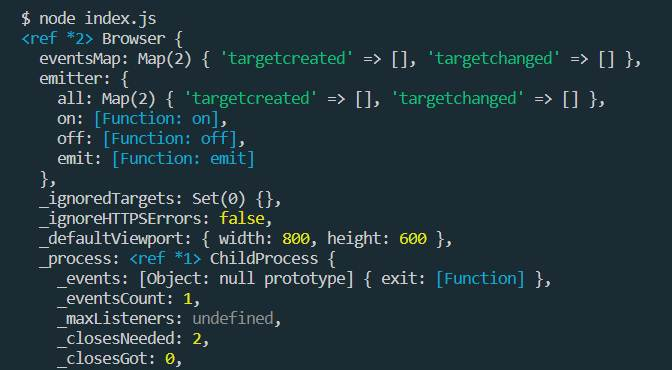

| INFO PROPERTY | VALUE                                                                      |
| ------------- | -------------------------------------------------------------------------- |
| Program Name  | **Course Work: Web APIs JavaScript Fetch getting JSON data Fun with APIs** |
| File Name     | README.md                                                                  |
| Date Created  | 06/17/22                                                                   |
| Date Modified | --                                                                         |
| Version       | 1.00                                                                       |
| Programmer    | Eric Hepperle                                                              |

### TECHNOLOGIES:

 

## Purpose:
**Course Work:** Explore how to connect to various web APIs using JavaScript fetch. Use the returned data JSON data within you Code. Learn FETCH API in with JavaScript.

## Description:

Web APIs JavaScript Fetch getting JSON data Fun with APIs

Explore how to connect to various web APIs using JavaScript fetch.  Use the returned data JSON data within you Code.

Explore JavaScript Objects and how you can get JSON data with an API connection using JavaScript Code

Get data from a web server and use that data within you JavaScript application.

### Concepts Covered:

- What JavaScript objects are and how to use them in code
- How to iterate through arrays and objects to get data
- Complex JavaScript Objects with many layers of data
- JSON lint and how to read JSON data
- How to use fetch to connect to web APIs
- Various examples of connecting to APIs to create interactive web applications.
- Using JavaScript code to connect to web APIs
- Setup of localhost using node and express
- Using node to make API requests
- Setup of local web host

### Materials/References:

- N/A

### Sample Code from Course:

    
## Usage:
1. CD to project folder in a shell terminal
2. Run npm start
3. Launch http://localhost:3000 in the browser, you should see an empty tic-tac-toe field.
    
## Sample results: 

## Requires:
* A web browser.
    
## Demonstrates:
* JavaScript
* APIs
* JSON
* Web Services
* AJAX
* Fetch API

## Based on this COURSE:
- Title: Web APIs JavaScript Fetch getting JSON data Fun with APIs
- URL: https://www.udemy.com/course/ajax-javascript-json/
- Channel: Laurence Svekis

## TAGS:
Puppeteer, Headless Browser, Web Scraping

## VOCAB:
- Tutwrk: This is term I use to indicate the work I did when following a Course. This term is differentiated from Courses I may create/author in the future that will be designated with the term "Course".

## Resources:
- N/A
